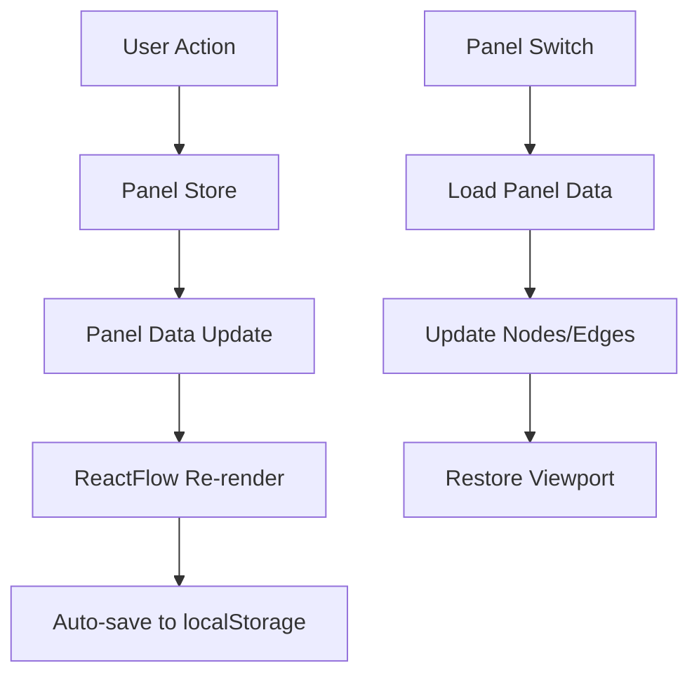

# Panel System Documentation

## Overview

Система панелей позволяет пользователям создавать и управлять множественными
рабочими пространствами с виджетами. Каждая панель имеет свои собственные узлы,
соединения и настройки viewport.

## Features

### ✅ Основные возможности:

1. **Создание панелей** - пользователь может создавать неограниченное количество
   панелей
2. **Переключение между панелями** - быстрый доступ через вкладки
3. **Изоляция данных** - каждая панель имеет свои собственные узлы и соединения
4. **Автосохранение** - все изменения автоматически сохраняются для каждой
   панели
5. **Управление панелями** - переименование, дублирование, удаление

### ✅ UI Components:

1. **PanelTabs** - вкладки для переключения между панелями
2. **PanelManager** - полное управление панелями
3. **MacOSDock** - обновлен с кнопкой Panel Manager

## Architecture

### Core Files

```
src/
├── lib/
│   └── panel-types.ts           # Типы для системы панелей
├── stores/
│   └── modules/
│       └── panel.store.ts       # Zustand store для панелей
├── components/
│   └── panels/
│       ├── PanelTabs.tsx        # Компонент вкладок
│       └── PanelManager.tsx     # Менеджер панелей
└── routes/
    └── main/
        └── canvas/
            ├── Flow.tsx         # Основной компонент (теперь простой wrapper)
            └── FlowWithPanels.tsx # Реализация с панелями
```

### Data Flow



## Usage

### Creating Panels

```typescript
import { usePanelStore } from "@/stores/modules/panel.store";

function MyComponent() {
  const { createPanel } = usePanelStore();

  const handleCreatePanel = () => {
    const panelId = createPanel("My Panel", "Description");
    console.log("Created panel:", panelId);
  };
}
```

### Switching Panels

```typescript
const { setActivePanel, getActivePanel } = usePanelStore();

// Switch to specific panel
setActivePanel("panel-123");

// Get current active panel
const activePanel = getActivePanel();
```

### Panel Data Management

```typescript
const { updatePanelData, getPanelData } = usePanelStore();

// Update panel data
updatePanelData(panelId, {
  nodes: newNodes,
  edges: newEdges,
  viewport: { x: 0, y: 0, zoom: 1 },
});

// Get panel data
const data = getPanelData(panelId);
```

## Panel Store API

### State

```typescript
interface PanelState {
  panels: Panel[]; // Все панели
  activePanelId: string | null; // ID активной панели
  panelData: Record<string, PanelData>; // Данные каждой панели
}
```

### Actions

```typescript
interface PanelActions {
  // CRUD операции
  createPanel: (name: string, description?: string) => string;
  deletePanel: (panelId: string) => void;
  updatePanel: (panelId: string, updates: Partial<Panel>) => void;
  duplicatePanel: (panelId: string) => string;

  // Переключение панелей
  setActivePanel: (panelId: string) => void;
  getActivePanel: () => Panel | null;

  // Управление данными
  updatePanelData: (panelId: string, data: Partial<PanelData>) => void;
  getPanelData: (panelId: string) => PanelData | null;

  // Утилиты
  getPanelById: (panelId: string) => Panel | null;
  getAllPanels: () => Panel[];
  clearAllPanels: () => void;
}
```

## Panel Structure

### Panel Interface

```typescript
interface Panel {
  id: string; // Уникальный ID
  name: string; // Отображаемое имя
  description?: string; // Описание
  isActive: boolean; // Активна ли панель
  createdAt: number; // Время создания
  updatedAt: number; // Время последнего обновления
  settings: PanelSettings; // Настройки панели
}
```

### Panel Data

```typescript
interface PanelData {
  panelId: string; // ID панели
  nodes: Node<FlowNodeData>[]; // Узлы ReactFlow
  edges: Edge[]; // Соединения ReactFlow
  viewport: { // Состояние viewport
    x: number;
    y: number;
    zoom: number;
  };
}
```

## UI Components

### PanelTabs

Компонент вкладок в верхней части интерфейса:

**Features:**

- Отображение всех панелей
- Переключение между панелями
- Контекстное меню для каждой вкладки
- Кнопка создания новой панели
- Inline редактирование имен

**Usage:**

```tsx
<PanelTabs className="flex-shrink-0" />;
```

### PanelManager

Модальное окно для полного управления панелями:

**Features:**

- Создание новых панелей
- Редактирование существующих
- Дублирование панелей
- Удаление панелей
- Переключение между grid/list view
- Массовые операции

**Usage:**

```tsx
<PanelManager
  isOpen={isOpen}
  onClose={() => setIsOpen(false)}
/>;
```

## Persistence

### Storage

Каждая панель сохраняется в localStorage под ключом `panel-store`:

```typescript
// Структура сохраненных данных
{
  panels: Panel[],
  activePanelId: string,
  panelData: Record<string, PanelData>
}
```

### Auto-save

Автоматическое сохранение происходит при:

- Изменении узлов (позиция, размер)
- Изменении соединений
- Изменении viewport
- Переключении панелей

## Integration with ReactFlow

### FlowWithPanels Component

Основной компонент, который интегрирует систему панелей с ReactFlow:

```typescript
function FlowWithPanels() {
  const { activePanelId, getPanelData, updatePanelData } = usePanelStore();

  // Загрузка данных панели при переключении
  useEffect(() => {
    if (activePanelId) {
      const panelData = getPanelData(activePanelId);
      // Загрузить узлы и соединения
    }
  }, [activePanelId]);

  // Автосохранение при изменениях
  const handleNodeChanges = useCallback((changes, nodes) => {
    if (activePanelId) {
      updatePanelData(activePanelId, { nodes });
    }
  }, [activePanelId, updatePanelData]);
}
```

## Keyboard Shortcuts

- `Ctrl+N` - Создать новую панель
- `Ctrl+Tab` - Переключить на следующую панель
- `Ctrl+Shift+Tab` - Переключить на предыдущую панель
- `Ctrl+W` - Закрыть текущую панель (если не последняя)

## Performance Considerations

### Optimization

1. **Lazy Loading** - данные панелей загружаются только при переключении
2. **Debounced Saving** - автосохранение с задержкой для оптимизации
3. **Selective Updates** - обновление только измененных данных
4. **Memory Management** - очистка неиспользуемых данных

### Limits

- Максимум панелей: неограниченно (ограничено localStorage)
- Максимум узлов на панель: ~1000 (ограничено производительностью ReactFlow)
- Размер данных панели: ~5MB (ограничено localStorage)

## Migration from Single Panel

Система обратно совместима. При первом запуске:

1. Автоматически создается "Default Panel"
2. Существующие данные загружаются в эту панель
3. Пользователь может создать дополнительные панели

## Future Enhancements

1. **Panel Templates** - предустановленные шаблоны панелей
2. **Panel Sharing** - экспорт/импорт панелей
3. **Panel Collaboration** - совместная работа над панелями
4. **Panel Analytics** - статистика использования панелей
5. **Panel Backup** - автоматическое резервное копирование
6. **Panel Search** - поиск по содержимому панелей
